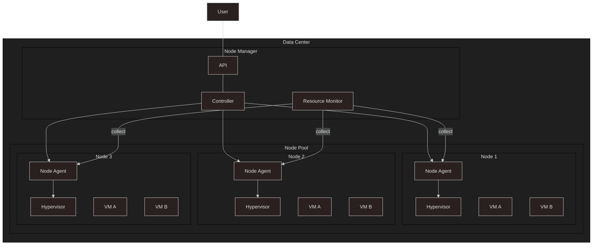

# Architecture

```mermaid
---
config:
  theme: neo-dark
---
flowchart TB
    subgraph Data Center
        direction TB
        subgraph Node Manager
            C1[Controller]
            MON[Resource Monitor]
            API1[API]
        end
        subgraph Node Pool
            subgraph Node 1
                NA1[Node Agent]
                HV1[Hypervisor]
                VM1A[VM A]
                VM1B[VM B]
            end
            subgraph Node 2
                NA2[Node Agent]
                HV2[Hypervisor]
                VM2A[VM A]
                VM2B[VM B]
            end
            subgraph Node 3
                NA3[Node Agent]
                HV3[Hypervisor]
                VM3A[VM A]
                VM3B[VM B]
            end
        end
    end
    USR1[User]
    NA1 --> HV1
    NA2 --> HV2
    NA3 --> HV3
    C1 --> NA1 & NA2 & NA3
    MON -->|collect| NA1 & NA2 & NA3
    API1 --- C1
    USR1 --- API1
```
