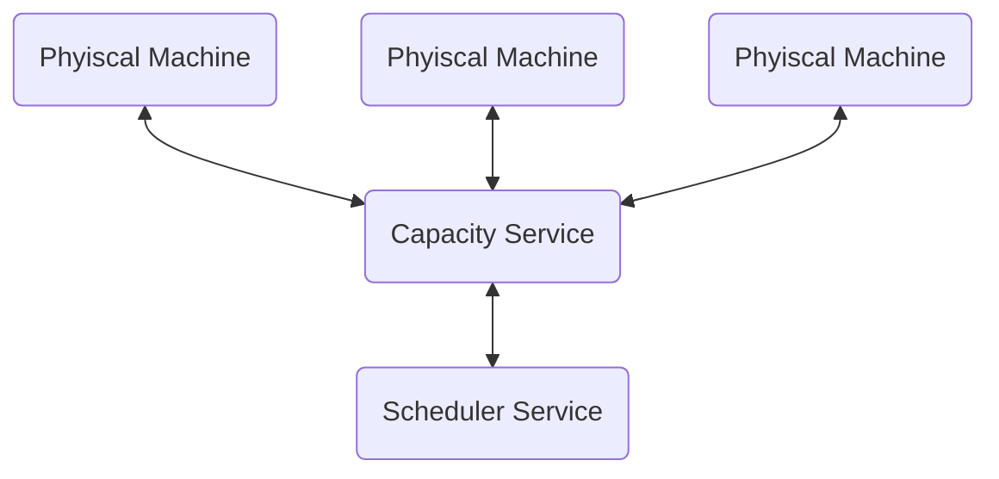

# Architecture Overview

## Capacity Service
The **Capacity Service** is responsible for monitoring all resources of the
physical machines. It stores the information in a dedicated database while
exposing data via API.

## Scheduler Service
The **Scheduler Service** controls the placement of new virual machines. It
uses the API of the Capacity Service to choose the most ideal physical machine.
